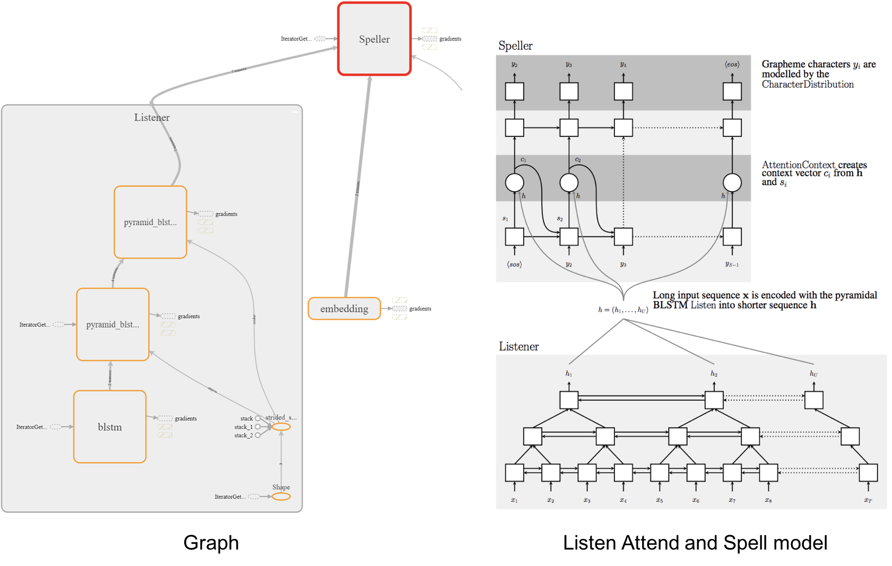

# A TensorFlow Implementation of [Listen Attention and Spell](https://arxiv.org/abs/1508.01211)

This is a tensorflow implementation of end-to-end ASR. Though there are several fantastic github repos in tensorflow, I tried to implemented it **without using `tf.contrib.seq2seq` API**. In addition, the performance on LibriSpeech dev/test datasets is presented.

## Overview



* Components:
    - Char/Subword text encoding.
    - MFCC/fbank acoustic features with CMVN.
    - LAS training (visualized with tensorboard: loss, sample text outputs, features, alignments).  
    - Joint CTC-Attention training. (See notes)
    - Batch testing using greedy decoder.
    - Beam search decoder.
    - RNNLM.

## Remarks

Note that this project is still in progress.
* Notes
    - Currently, I only test this model on: MFCC 39 (13+delta+accelerate) features + character text encoding + training without CTC loss.
    - BPE and CTC related parts are not yet fully tested.
    - Volume augmentation is currently commented out because it shows little improvements.

* Improvements
    - Augmentation include speed perturbation. (IMPORTANT) 
    - Label smoothing. (IMPORANT)
    - Bucketing.

* Some advice
    - Generally, LibriSpeech-100 is not large enough unless you perform speed augmentation.
    - **In my experience, adding more data is the best policy.**
    - A better way to check if your model is learning in a right way is to monitor the speech-text aligments in tensorboard as below.


## Requirements
```
pip3 install virtualenv
virtualenv --python=python3 venv
source venv/bin/activate
pip3 install -r requirements.txt
```

## Prepare libirspeech train/dev/test data
```
sh prepare_libri_data.sh LibriSpeech-100 (OR LibriSpeech-360)
```

## Prepare tedlium train/dev/test data
```
sh prepare_ted_data.sh TED-LIUMv1 (OR TED-LIUMv2)
```
## Train

## Test

## Decode

## Tensorboard
```
tensorboard --logdir ./summary
```

## TODO
- [ ] Evaluate performance with subword unit: Subword las training, subword-based RNNLM. 
- [ ] Evaluate performance on joint CTC training, decoding.
- [ ] Test on TEDLIUM dataset.
- [ ] Add other attention mechanisms such as multi-head attention. 
- [ ] Add scheduled sampling.
