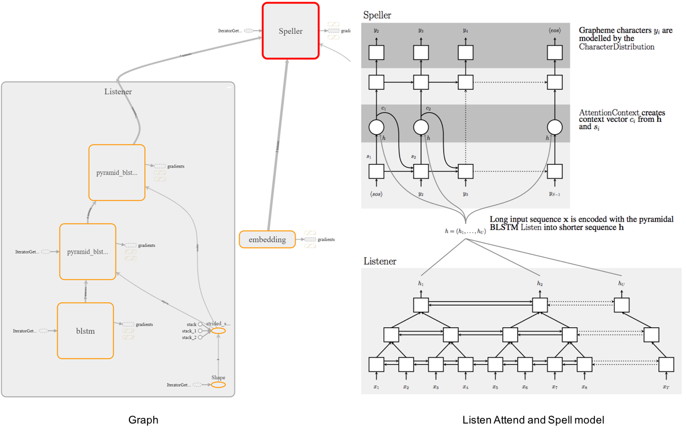

# A TensorFlow Implementation of [Listen Attention and Spell](https://arxiv.org/abs/1508.01211)

This is a tensorflow implementation of end-to-end ASR. Though there are several fantastic github repos in tensorflow, I tried to implement it **without using `tf.contrib.seq2seq` API** in this repo. In addition, the performance on LibriSpeech dev/test sets is evaluated and the evaluation results are reasonable.

## Overview

<p align="center">
  
</p>

* Components:
    - Char/Subword text encoding.
    - MFCC/fbank acoustic features with per utterance CMVN.
    - LAS training (visualized with tensorboard: loss, sample text outputs, features, alignments).  
    - TFrecord dataset pipline.
    - Batch testing using greedy decoder.
    - Beam search decoder.
    - RNNLM.

## Remarks

Note that this project is still in progress.
* Notes
    - Currently, I only test this model on MFCC 39 (13+delta+accelerate) features w/ character text encoding.
    - BPE and CTC related parts are not yet fully tested.
    - Volume augmentation is currently commented out because it shows little improvements.

* Improvements
    - CNN based Listener.
    - Augmentation include speed perturbation. (IMPORTANT) 
    - Label smoothing. (IMPORANT)
    - Bucketing.
    - Scheduled sampling.
    - Scheduled learning rate.

* Some advice
    - Generally, LibriSpeech-100 is not large enough unless you perform speed augmentation.
    - **In my experience, adding more data is the best policy.**
    - A better way to check if your model is learning in a right way is to monitor the speech-text aligments in tensorboard.

<p align="center">
  
</p>

## Requirements
```bash
pip3 install virtualenv
virtualenv --python=python3 venv
source venv/bin/activate
pip3 install -r requirements.txt
```

## Arguments

The definitions of the args are described in `las/arguments.py`. You can modify all args there before preprocessing, training, testing and decoding.

## Usage

### 0) Prepare data
- Libirspeech train/dev/test data
```bash
bash prepare_libri_data.sh 
```

### 1) Preprocess Audios & Texts.
Prepare Libirspeech train/dev/test data:
```bash
python3 preprocess.py --dataset LibriSpeech \
                      --train_data_dir data/LibriSpeech/LibriSpeech_train/train-clean-100/ \
                      --feat_dir data/LibriSpeech/features \
                      --unit UNIT \
                      --augmentation AUGMENTATION \
                      --feat_type FEAT_TYPE \
                      --feat_dim FEAT_DIM
```

### 2) Training
Train Listen Attend and Spell:
```bash
python3 train.py --unit UNIT \
                 --augmentation AUGMENTATION \
                 --label_smoothing LABEL_SMOOTHING \
                 --enc_units ENC_UNITS \
                 --dec_units DEC_UNITS \
                 --num_enc_layers NUM_ENC_LAYERS \
                 --num_dec_layers NUM_DEC_LAYERS \
                 --embedding_size EMBEDDING_SIZE \
                 --attention_size ATTENTION_SIZE \
                 --batch_size BATCH_SIZE \
                 --dropout_rate DROPOUT_RATE \
                 --teacher_forcing_rate TEACHER_FORCING_RATE \
                 --lr LR \
                 --epoch EPOCH \
                 --bucketing BUCKETING \
                 --feat_dim FEAT_DIM \ 
                 --feat_dir FEAT_DIR \
                 --grad_clip GRAD_CLIP \
                 --maxlen MAXLEN \
                 --save_dir SAVE_DIR \
                 --summary_dir SUMMARY_DIR 
```
Train RNNLM: 
(NOT READY)

### 3) Testing
Testing with gready decoder.
```bash
python3 test.py --split SPLIT \           # test or dev
                --unit UNIT \ 
                --feat_dim FEAT_DIM \ 
                --feat_dir FEAT_DIR \
                --save_dir SAVE_DIR 
```

## 4) Decode
Beam search decoder.
```bash
python3 decode.py --split SPLIT \         # test or dev
                  --unit UNIT \ 
                  --beam_size BEAM_SIZE \
                  --convert_rate 0.24 \   # 0.24 is large enough.
                  --apply_lm APPLY_LM \         
                  --lm_weight LM_WEIGHT \
                  --feat_dim FEAT_DIM \ 
                  --feat_dir FEAT_DIR \
                  --save_dir SAVE_DIR 
```

## Tensorboard
```
tensorboard --logdir ./summary
```

## Results
Results trained on LibriSpeech-360 (WER)
| Model |  dev-clean  |  test-clean  | 
|:-----:|:-----:|:-----:|
| Char LAS | 0.249  | 0.262  |

## Reference
- [Listen, Attend and Spell](https://arxiv.org/pdf/1508.01211.pdf)
- [State-of-the-Art Speech Recognition with Sequence-to-Sequence Models](https://arxiv.org/pdf/1712.01769.pdf)
- [On the Choice of Modeling Unit for Sequence-to-Sequence Speech Recognition](https://arxiv.org/pdf/1902.01955.pdf)
- Char RNNLM: [TensorFlow-Char-RNN](https://github.com/crazydonkey200/tensorflow-char-rnn)
- A nice Pytorch version: [End-to-end-ASR-Pytorch](https://github.com/Alexander-H-Liu/End-to-end-ASR-Pytorch).

## TODO
- [X] Add scheduled sampling.
- [ ] Evaluate the performance with subword unit: Subword las training. 
- [ ] Decoding with subword-based RNNLM. 
- [ ] Evaluate the performance on joint CTC training, decoding.
- [ ] Add other attention mechanisms such as location attention.
